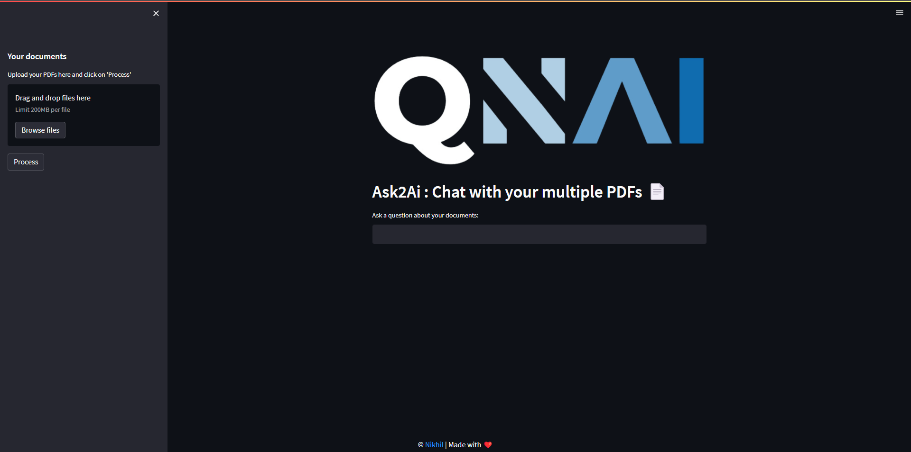
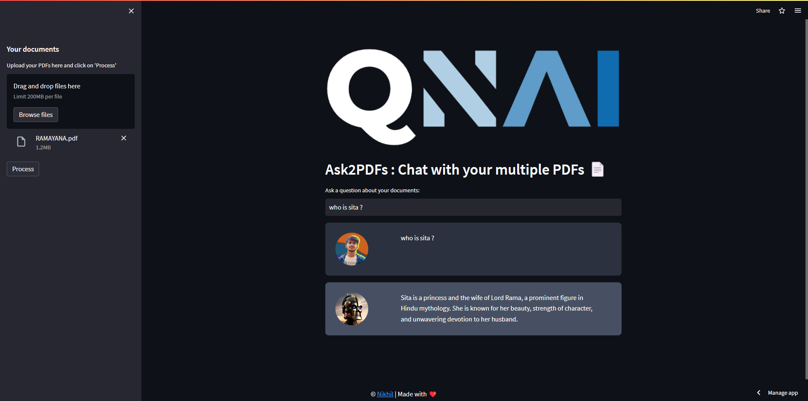
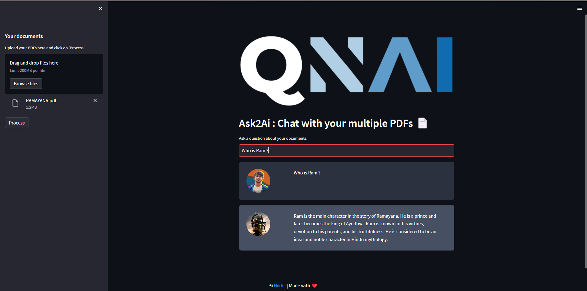

# QnAi : Ask2Ai 
## Chat with your multiple PDFs

## What is QnAi?
------------
The QnAi Chat App is a Python application designed for conversing with multiple PDF documents. Using natural language, you can ask questions about the PDFs, and the app will generate relevant responses based on the document content. The application employs a language model to ensure accurate answers. It's important to note that the app will only respond to questions that pertain to the PDFs that have been loaded into the system.
## How It Works
------------


To generate responses to your queries, the application follows these steps:

1. PDF Loading: The app reads and extracts text content from multiple PDF documents.

2. Text Chunking: The extracted text is segmented into smaller, more manageable chunks for effective processing.

3. Language Model: The application employs a language model to create vector representations (embeddings) of the text chunks.

4. Similarity Matching: When you pose a question, the app compares it with the text chunks to identify the most semantically similar ones.

5. Response Generation: The chosen chunks are then fed into the language model, which generates a response based on the relevant content found in the PDFs.

## Demo
------------------------



## Dependencies and Installation
----------------------------
To install the QnAi Chat App, please follow these steps:

1. Clone the repository to your local machine.

2. Install the required dependencies by running the following command:
   ```
   pip install -r requirements.txt
   ```

3. Obtain an API key from OpenAI and add it to the `.env` file in the project directory.
```commandline
OPENAI_API_KEY=your_secrit_api_key
```

## Usage
-----
To use the QnAi Chat App, follow these steps:

1. Ensure that you have installed the required dependencies and added the OpenAI API key to the `.env` file.

2. Run the `app.py` file using the Streamlit CLI. Execute the following command:
   ```
   streamlit run app.py
   ```

3. The application will launch in your default web browser, displaying the user interface.

4. Load multiple PDF documents into the app by following the provided instructions.

5. Don't forget to click on Process.

6. Ask questions in natural language about the loaded PDFs using the chat interface.

## Contributing
------------
This repository is for educational purposes only and is not open to further contributions. It serves as a tutorial that demonstrates how to build this project. You are free to use and enhance the app according to your own needs.
